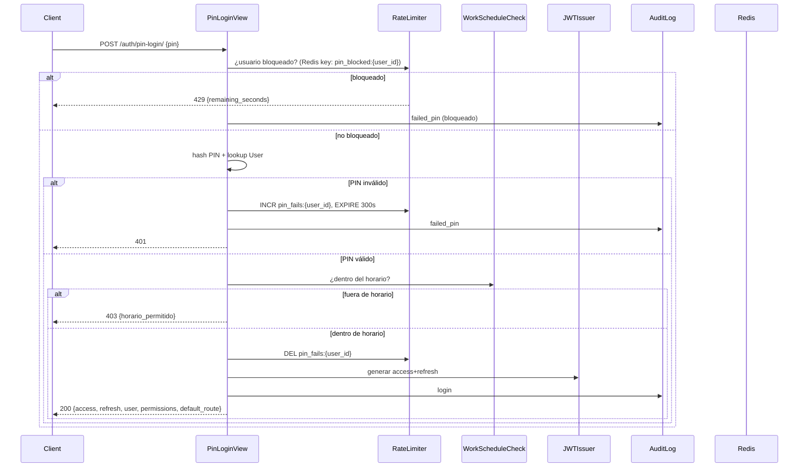
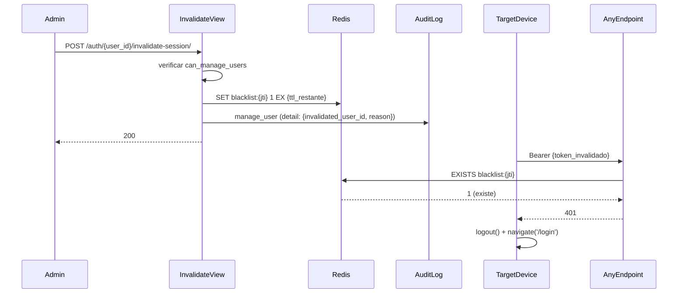

# Design Document — Módulo de Seguridad

## Overview

El módulo de seguridad amplía la base de autenticación existente (JWT + PIN SHA-256 + `RoleGuard`)
para cubrir los requisitos operativos de D' Yiya Restaurants. El principio rector es **extender lo
que ya existe antes de crear algo nuevo**. Ningún componente se duplica; cada decisión justifica
su existencia.

Alcance del módulo:
- Ocho roles de sistema con rutas por defecto
- Siete permisos granulares por usuario con límite de descuento
- Auditoría inmutable de diez acciones sensibles
- Auto-logout por inactividad (10 min) con aviso en los últimos 60 s
- Rate limiting de PIN en Redis (5 intentos / 5 min → bloqueo 300 s)
- Control de horario laboral por usuario (zona `America/Santo_Domingo`)
- Invalidación remota de sesiones via Redis blacklist
- JWT con access 15 min / refresh 8 h

Todo el código nuevo vive en `apps/accounts/` (modelos + lógica relacionada con usuarios) y
en una nueva app `apps/audit/` (justificación abajo). El frontend extiende los archivos
existentes sin crear stores nuevos.


---

## Architecture

### Decisiones clave y sus justificaciones

**¿`apps/audit/` o dentro de `apps/accounts/`?**

`AuditLog` recibe escrituras desde `apps/orders/`, `apps/cashier/`, `apps/billing/` y
`apps/accounts/`. Si el modelo vive en `apps/accounts/`, todas esas apps tendrían que importar
desde `accounts`, creando acoplamiento circular o dependencias no naturales. Una app `apps/audit/`
con un solo modelo y un helper `log()` mantiene el grafo de dependencias limpio: cualquier app
puede importar `from apps.audit.models import AuditLog` sin ciclos. Es la excepción justificada
a "no crear apps innecesarias".

**Session blacklist: `simplejwt token_blacklist` vs Redis manual**

`simplejwt` `token_blacklist` escribe en PostgreSQL. Para cada request autenticado hay que hacer
un SELECT adicional a la tabla `blacklistedtoken`. En un POS con tablets haciendo requests cada
pocos segundos, ese overhead importa. Redis ya está disponible para Channels y Celery. Con una
clave `blacklist:{jti}` y TTL == tiempo restante del token, el lookup es O(1) y la expiración es
automática. La implementación manual en Redis es más eficiente y no agrega ninguna dependencia
nueva. **Decisión: Redis manual.**

**`WorkSchedule`: modelo separado vs JSONField en `UserPermissions`**

Un JSONField en `UserPermissions` mezcla dos conceptos distintos (permisos granulares vs horario
laboral) en un modelo, complica las validaciones y dificulta la indexación futura. Un modelo
`WorkSchedule` con FK a `User` separa responsabilidades, permite `null` (sin restricción horaria)
de forma natural y es fácil de extender. Solo agrega una tabla pequeña. **Decisión: modelo
separado.**

**¿`django-ratelimit` o implementación manual con `django-redis`?**

`django-ratelimit` opera por IP o por campo de request, no por usuario identificado en la DB.
Para rate limiting *por usuario* (contar intentos fallidos del mismo user_id en Redis) es más
directo implementar el contador manualmente con `cache.incr()` y `cache.expire()`, que ya
están disponibles vía `django-redis`. No se agrega ninguna dependencia nueva. **Decisión:
implementación manual con el cache Redis ya configurado.**


### Flujo de autenticación con las nuevas capas




### Flujo de invalidación remota de sesiones




---

## Components and Interfaces

### Backend — Archivos modificados vs nuevos

| Archivo | Estado | Qué cambia |
|---|---|---|
| `apps/accounts/models.py` | **MODIFICAR** | Agregar 4 roles al `Role.TextChoices`; agregar `UserPermissions` (OneToOne + 7 bool + discount_limit); agregar `WorkSchedule` (FK User + 3 campos); agregar signal `post_save` para defaults |
| `apps/accounts/permissions.py` | **MODIFICAR** | Agregar `HasGranularPermission(perm_name)`; agregar `IsOwnerReadOnly`; actualizar roles en guards existentes |
| `apps/accounts/serializers.py` | **MODIFICAR** | Agregar `UserPermissionsSerializer`; agregar `PermissionsUpdateSerializer`; agregar `WorkScheduleSerializer`; extender `UserSerializer` para incluir `default_route` y `permissions` en respuesta de login |
| `apps/accounts/views.py` | **MODIFICAR** | Extender `PinLoginView` y `LoginView` con rate limiting, schedule check y AuditLog; agregar `UserPermissionsView`, `InvalidateSessionView`, `UnlockUserView`, `ChangePinView`; agregar `default_route` a response |
| `apps/accounts/urls.py` | **MODIFICAR** | Agregar rutas para nuevos endpoints |
| `apps/accounts/apps.py` | **MODIFICAR** | Registrar signal de `post_save` para `UserPermissions` |
| `config/settings/base.py` | **MODIFICAR** | Cambiar `SIMPLE_JWT` lifetimes; agregar `apps.audit` a `INSTALLED_APPS`; agregar throttle rate `pin_login: "10/min"` |
| `config/urls.py` | **MODIFICAR** | Agregar `path("audit/", include("apps.audit.urls"))` |
| `apps/audit/__init__.py` | **NUEVO** | App init |
| `apps/audit/apps.py` | **NUEVO** | App config |
| `apps/audit/models.py` | **NUEVO** | Modelo `AuditLog` inmutable |
| `apps/audit/views.py` | **NUEVO** | `AuditLogListView`, `AuditSummaryView` |
| `apps/audit/urls.py` | **NUEVO** | Rutas de auditoría |
| `apps/audit/serializers.py` | **NUEVO** | `AuditLogSerializer` |
| `apps/audit/helpers.py` | **NUEVO** | Función `log(action, actor, ...)` importable desde cualquier app |

### Frontend — Archivos modificados vs nuevos

| Archivo | Estado | Qué cambia |
|---|---|---|
| `src/stores/auth.store.ts` | **MODIFICAR** | Agregar `permissions` al estado y `setPermissions`; agregar `setAuth` extendido que recibe `permissions` |
| `src/lib/types.ts` | **MODIFICAR** | Extender `UserRole` con 4 roles nuevos; agregar interface `UserPermissions`; agregar `default_route` a `AuthResponse` |
| `src/components/layout/RoleGuard.tsx` | **MODIFICAR** | Soporte para los 4 roles nuevos (cambio trivial de tipo) |
| `src/services/auth.service.ts` | **MODIFICAR** | Agregar `getMyPermissions()`, `invalidateSession()`, `unlockUser()`, `changePin()`, `updateSchedule()` |
| `src/components/layout/PermissionGuard.tsx` | **NUEVO** | Guard de permiso granular que oculta (no deshabilita) children |
| `src/hooks/useIdleTimer.ts` | **NUEVO** | Hook de inactividad: 600s timer, aviso en <60s, logout automático |


### Nuevos endpoints API

| Método | URL | Permiso requerido | Descripción |
|---|---|---|---|
| `GET` | `/api/v1/auth/me/permissions/` | Autenticado | Devuelve los 7 permisos + discount_limit del usuario actual |
| `PATCH` | `/api/v1/auth/users/{id}/permissions/` | `can_manage_users` | Actualiza permisos de otro usuario (solo campos enviados) |
| `POST` | `/api/v1/auth/{user_id}/invalidate-session/` | `can_manage_users` | Invalida tokens del usuario en Redis |
| `POST` | `/api/v1/auth/{user_id}/unlock/` | `can_manage_users` | Desbloquea usuario con PIN bloqueado |
| `POST` | `/api/v1/auth/me/change-pin/` | Autenticado | Cambia PIN propio (requiere PIN actual) |
| `PATCH` | `/api/v1/auth/users/{id}/schedule/` | `can_manage_users` | Crea/actualiza/elimina WorkSchedule |
| `GET` | `/api/v1/audit/logs/` | `can_view_reports` | Logs paginados (50/página) con filtros |
| `GET` | `/api/v1/audit/summary/` | `can_view_reports` | Conteo agrupado por acción en rango de fechas |

### Redis key schema

| Clave | Tipo | TTL | Propósito |
|---|---|---|---|
| `blacklist:{jti}` | String | TTL restante del token | Session blacklist |
| `pin_fails:{user_id}` | String (int) | 300 s desde primer fallo | Contador de intentos fallidos de PIN |
| `pin_blocked:{user_id}` | String | 300 s desde el bloqueo | Flag de bloqueo activo |


---

## Data Models

### `Role` — extender `TextChoices` en `apps/accounts/models.py`

```python
class Role(models.TextChoices):
    OWNER     = "owner",     _("Propietario")
    MANAGER   = "manager",   _("Gerente")
    CASHIER   = "cashier",   _("Cajero")
    BARTENDER = "bartender", _("Bartender")
    ADMIN     = "admin",     _("Administrador")
    WAITRESS  = "waitress",  _("Mesera")
    COOK      = "cook",      _("Cocinero")
    UTILITY   = "utility",   _("Utility / Stewart")
```

Solo se agregan 4 valores. La migración es automática (altera el constraint CHECK en PostgreSQL).
Los usuarios existentes con roles `admin`, `waitress`, `cook`, `utility` no son afectados.

### `UserPermissions` — nuevo modelo en `apps/accounts/models.py`

```python
class UserPermissions(BaseModel):
    user = models.OneToOneField(
        User, on_delete=models.CASCADE, related_name="permissions"
    )
    can_void_orders    = models.BooleanField(default=False)
    can_apply_discount = models.BooleanField(default=False)
    can_view_reports   = models.BooleanField(default=False)
    can_manage_menu    = models.BooleanField(default=False)
    can_open_cashier   = models.BooleanField(default=False)
    can_manage_users   = models.BooleanField(default=False)
    can_view_all_orders= models.BooleanField(default=False)
    discount_limit     = models.IntegerField(
        default=0,
        validators=[MinValueValidator(0), MaxValueValidator(100)],
        help_text="Porcentaje máximo de descuento permitido [0–100]",
    )
```

La señal `post_save` en `User` crea `UserPermissions` con defaults según `user.role`.
Hereda `BaseModel` (UUID pk, created_at, updated_at, tenant_id).

**Tabla de defaults por rol:**

| Permiso | owner | manager | cashier | bartender | admin | waitress | cook | utility |
|---|---|---|---|---|---|---|---|---|
| can_void_orders | ✓ | ✓ | ✗ | ✗ | ✓ | ✗ | ✗ | ✗ |
| can_apply_discount | ✓ | ✓ | ✓ | ✗ | ✓ | ✗ | ✗ | ✗ |
| can_view_reports | ✓ | ✓ | ✗ | ✗ | ✓ | ✗ | ✗ | ✗ |
| can_manage_menu | ✓ | ✗ | ✗ | ✗ | ✓ | ✗ | ✗ | ✗ |
| can_open_cashier | ✓ | ✓ | ✓ | ✗ | ✓ | ✗ | ✗ | ✗ |
| can_manage_users | ✓ | ✗ | ✗ | ✗ | ✓ | ✗ | ✗ | ✗ |
| can_view_all_orders | ✓ | ✓ | ✓ | ✓ | ✓ | ✗ | ✗ | ✗ |
| discount_limit | 100 | 20 | 10 | 0 | 100 | 5 | 0 | 0 |


### `WorkSchedule` — nuevo modelo en `apps/accounts/models.py`

```python
class WorkSchedule(BaseModel):
    user = models.OneToOneField(
        User, on_delete=models.CASCADE, related_name="work_schedule"
    )
    work_days  = models.JSONField(
        help_text="Lista de días permitidos: 0=lunes … 6=domingo",
        validators=[validate_work_days],
    )
    work_start = models.TimeField(help_text="Hora de inicio HH:MM")
    work_end   = models.TimeField(help_text="Hora de fin HH:MM")
```

Justificación de `JSONField` para `work_days`: un array de 1–7 enteros (0–6) no justifica
una tabla intermedia ni un campo por día. El validador `validate_work_days` verifica: lista
no vacía, máximo 7 elementos, sin duplicados, todos en rango [0, 6]. La evaluación de horario
usa `datetime.now(ZoneInfo("America/Santo_Domingo"))`.

**Constraint adicional a nivel de modelo:** `work_start` < `work_end` con diferencia ≥ 1 minuto,
validado en `clean()`.

### `AuditLog` — nuevo modelo en `apps/audit/models.py`

```python
class AuditLog(models.Model):
    id             = models.UUIDField(primary_key=True, default=uuid.uuid4, editable=False)
    action         = models.CharField(max_length=50, db_index=True)
    actor_id       = models.UUIDField(db_index=True)
    actor_username = models.CharField(max_length=150)
    target_id      = models.UUIDField(null=True, blank=True)
    target_type    = models.CharField(max_length=50, blank=True)
    detail         = models.JSONField(default=dict)
    ip_address     = models.GenericIPAddressField(null=True)
    timestamp      = models.DateTimeField(auto_now_add=True, db_index=True)
```

**Inmutabilidad**: sobrescribe `save()` para bloquear updates y `delete()` para bloquear
eliminaciones. También registra una señal `pre_delete` como capa de seguridad adicional.
**No hereda `BaseModel`** (que tiene `updated_at` auto_now, incompatible con inmutabilidad).
**Índice compuesto** en `(action, timestamp)` para satisfacer el requisito de < 2 s en
consultas de 31 días (Requirement 13.3).

**Acciones válidas (10):**
`void_order`, `apply_discount`, `login`, `logout`, `failed_pin`, `manage_user`,
`open_cashier`, `close_cashier`, `change_price`, `delete_menu_item`


### `HasGranularPermission` — extender `apps/accounts/permissions.py`

```python
class HasGranularPermission(permissions.BasePermission):
    """
    Uso: permission_classes = [IsAuthenticated, HasGranularPermission("can_void_orders")]
    """
    def __init__(self, perm_name: str):
        self.perm_name = perm_name

    def has_permission(self, request, view):
        if not request.user.is_authenticated:
            return False
        try:
            return getattr(request.user.permissions, self.perm_name, False)
        except UserPermissions.DoesNotExist:
            return False

    def message(self):
        return {"required_permission": self.perm_name}
```

`IsOwnerReadOnly` — nueva clase que permite al rol `owner` solo métodos SAFE, excepto
`POST /api/accounts/me/change-pin/` y `POST /api/accounts/{id}/invalidate-session/`.

### Rate limiting PIN — helper en `apps/accounts/views.py`

```python
PIN_FAILS_KEY    = "pin_fails:{}"      # TTL 300s, incr en cada fallo
PIN_BLOCKED_KEY  = "pin_blocked:{}"    # TTL 300s, set al 5to fallo
PIN_MAX_ATTEMPTS = 5
PIN_BLOCK_TTL    = 300  # segundos

def check_pin_rate_limit(user_id: str) -> tuple[bool, int]:
    """
    Retorna (is_blocked, remaining_seconds).
    """
    ...

def record_pin_failure(user_id: str) -> None:
    """
    Incrementa contador. Si llega a PIN_MAX_ATTEMPTS, activa el bloqueo.
    """
    ...

def reset_pin_counter(user_id: str) -> None:
    ...
```

### Frontend — extensión de `auth.store.ts`

```typescript
interface UserPermissions {
  can_void_orders:     boolean;
  can_apply_discount:  boolean;
  can_view_reports:    boolean;
  can_manage_menu:     boolean;
  can_open_cashier:    boolean;
  can_manage_users:    boolean;
  can_view_all_orders: boolean;
  discount_limit:      number;
}

interface AuthState {
  // ...existente...
  permissions: UserPermissions | null;
  setAuth: (user: User, access: string, refresh: string, permissions: UserPermissions) => void;
  setPermissions: (permissions: UserPermissions) => void;
}
```


### Frontend — `PermissionGuard.tsx` (nuevo)

```typescript
interface PermissionGuardProps {
  permission: keyof UserPermissions;
  children: React.ReactNode;
}

export function PermissionGuard({ permission, children }: PermissionGuardProps) {
  const permissions = useAuthStore((s) => s.permissions);
  if (!permissions || !permissions[permission]) return null; // oculta, no deshabilita
  return <>{children}</>;
}
```

### Frontend — `useIdleTimer.ts` (nuevo)

```typescript
export function useIdleTimer(timeoutSeconds = 600) {
  // Estado: timerRef (setInterval de 1s), showWarning (booleano)
  // Eventos escuchados: 'mousemove','keydown','touchstart','scroll'
  // Al llegar a 0: enviar AuditLog logout → logout() → navigate('/login')
  // Al caer < 60: setShowWarning(true)
  // Cualquier evento durante aviso: resetear y ocultar aviso
  // Solo activar cuando useAuthStore(s => s.user) !== null
  return { timeLeft, showWarning };
}
```

El hook usa `useCallback` para el listener de eventos y lo registra/desregistra con
`addEventListener`/`removeEventListener` para evitar leaks. El intervalo de 1s no re-renderiza
componentes pesados porque el state vive en el hook local, no en el store global.

---

## Correctness Properties

*Una propiedad es una característica o comportamiento que debe ser verdadera en todas las
ejecuciones válidas de un sistema — esencialmente, una declaración formal sobre lo que el sistema
debe hacer. Las propiedades sirven como puente entre especificaciones legibles por humanos y
garantías de corrección verificables automáticamente.*


**Reflexión sobre redundancias antes de listar las propiedades:**

- Las propiedades sobre "crear usuario con defaults por rol" (2.2 y 3.2) se combinan en una
  sola propiedad que verifica tanto los 7 permisos booleanos como el `discount_limit`.
- Las propiedades 4.5 y 4.7 (atomicidad transaccional del AuditLog) son la misma propiedad
  desde ángulos distintos — se unifican.
- Las propiedades 8.2 y 8.3 (blacklist) se combinan en una propiedad round-trip.
- Las propiedades 12.1, 12.2 y 12.3 son variaciones de la misma round-trip de permisos —
  se unifican en una sola.
- La propiedad 6.3 (bloqueado rechaza cualquier PIN) está implícita en 6.2 — se mantiene
  separada porque prueba un comportamiento distinto (no validar el PIN en absoluto).

---

### Property 1: Validación exhaustiva de roles

*Para cualquier* string asignado como `role` al crear o actualizar un usuario, el sistema
**acepta** el valor si y solo si está en el conjunto exacto `{owner, manager, cashier,
bartender, admin, waitress, cook, utility}`. Cualquier otro valor es rechazado con HTTP 400.

**Validates: Requirements 1.1, 1.4**

---

### Property 2: Defaults de permisos y descuento por rol

*Para cualquier* rol válido de los ocho definidos, crear un usuario con ese rol produce
automáticamente un objeto `UserPermissions` cuyos 7 campos booleanos y cuyo `discount_limit`
coinciden exactamente con la tabla de defaults del diseño. Ningún campo tiene un valor
diferente al especificado para ese rol.

**Validates: Requirements 2.2, 3.2**

---

### Property 3: PATCH de permisos modifica solo los campos enviados

*Para cualquier* subconjunto no vacío de los 7 permisos granulares enviado en un request
PATCH, únicamente los campos incluidos en el payload cambian su valor; todos los campos
no incluidos en el payload permanecen con su valor original.

**Validates: Requirements 2.3**

---

### Property 4: Respuesta 403 incluye el permiso faltante exacto

*Para cualquier* permiso `p` de los 7 definidos, un usuario cuyo `UserPermissions.{p}` sea
`false` que intente ejecutar una acción protegida por ese permiso recibe HTTP 403 con un
cuerpo JSON que contiene `required_permission` igual a la cadena exacta del nombre de `p`.

**Validates: Requirements 2.4**

---

### Property 5: Validación del rango de discount_limit

*Para cualquier* entero en el rango [0, 100], actualizar el `discount_limit` de un usuario
debe ser aceptado y persistido. *Para cualquier* valor fuera de ese rango o que no sea un
entero, la operación debe ser rechazada con HTTP 400.

**Validates: Requirements 3.1, 3.5**

---

### Property 6: Descuento no puede superar discount_limit del usuario

*Para cualquier* usuario con `discount_limit = X` y `can_apply_discount = true`, un intento
de aplicar un descuento de porcentaje `Y` es aceptado si `Y ≤ X` y rechazado con HTTP 400
si `Y > X`.

**Validates: Requirements 3.3**

---

### Property 7: Toda acción auditada genera exactamente una entrada en AuditLog

*Para cualquier* ocurrencia de una de las 10 acciones auditables, el conteo de entradas en
`AuditLog` con `action` correspondiente se incrementa en exactamente 1, y la entrada
resultante contiene todos los campos requeridos (`id`, `action`, `actor_id`, `actor_username`,
`target_id`, `target_type`, `detail`, `ip_address`, `timestamp`) con los tipos correctos.

**Validates: Requirements 4.1, 4.2**


### Property 8: AuditLog es inmutable

*Para cualquier* entrada existente en `AuditLog`, cualquier intento de modificarla (UPDATE
vía ORM) o eliminarla (DELETE vía ORM, API o señal) debe ser rechazado con un error. Nunca
se devuelve éxito en operaciones de modificación sobre el log.

**Validates: Requirements 4.3**

---

### Property 9: void_order con reason inválida no crea AuditLog ni ejecuta la anulación

*Para cualquier* string `reason` de longitud < 10 (incluyendo el string vacío y `null`),
un request `void_order` retorna HTTP 400, el conteo de `AuditLog` no cambia, y la orden
permanece con su estado original.

**Validates: Requirements 4.4**

---

### Property 10: Atomicidad AuditLog — fallo del log revierte la acción principal

*Para cualquier* acción auditable que falle la escritura en `AuditLog` (simulado con un
mock que lanza excepción en `AuditLog.save()`), la acción principal también es revertida.
El estado de la base de datos queda idéntico al estado previo a la operación.

**Validates: Requirements 4.5, 4.7**

---

### Property 11: Filtros de AuditLog son correctos y completos

*Para cualquier* combinación válida de filtros `{action, actor_id, date_from, date_to}`
aplicada a `GET /api/audit/logs/`, todos los resultados retornados satisfacen
simultáneamente todos los filtros aplicados, y no existe ninguna entrada en `AuditLog`
que satisfaga todos los filtros y no esté en los resultados.

**Validates: Requirements 4.6**

---

### Property 12: Inactivity_Timer se reinicia al 100% ante cualquier interacción

*Para cualquier* valor `t` del timer en el rango `[0, 600]`, cuando el usuario genera un
evento de tipo `mousemove`, `keydown`, `touchstart` o `scroll`, el valor del timer pasa
a ser 600 (independientemente del valor previo).

**Validates: Requirements 5.1, 5.4**

---

### Property 13: Aviso de inactividad es visible si y solo si timer < 60

*Para cualquier* valor `t` del timer, el componente de aviso de inactividad está montado
en el DOM si y solo si `t < 60` y `t > 0`. Cuando `t ≥ 60`, el aviso no está presente.

**Validates: Requirements 5.3**

---

### Property 14: Inactivity_Timer solo corre con usuario autenticado

*Para cualquier* estado del `AuthStore`, el timer está activo (setInterval en ejecución)
si y solo si `user !== null`. Al hacer logout (manual o automático), el timer se detiene.
Con `user === null`, ningún intervalo de actualización está programado.

**Validates: Requirements 5.7**


### Property 15: Contador de intentos fallidos de PIN incrementa correctamente

*Para cualquier* secuencia de `n` intentos fallidos de PIN (donde `n < 5`) dentro de la
ventana de 5 minutos, el valor de `pin_fails:{user_id}` en Redis es exactamente `n`. El
contador persiste entre requests y no se resetea espontáneamente dentro de la ventana.

**Validates: Requirements 6.1**

---

### Property 16: PIN bloqueado rechaza cualquier intento sin validar el PIN

*Para cualquier* valor de PIN enviado mientras el usuario está en estado bloqueado
(`pin_blocked:{user_id}` existe en Redis), el sistema retorna HTTP 429 con `remaining_seconds`
sin realizar ninguna consulta a la tabla `User`. El valor del PIN no importa — el bloqueo
es independiente de su corrección.

**Validates: Requirements 6.2, 6.3**

---

### Property 17: PIN exitoso resetea el contador de intentos fallidos a cero

*Para cualquier* valor `n` en `[1, 4]` intentos fallidos registrados, cuando el usuario
autentica con el PIN correcto, el contador `pin_fails:{user_id}` es eliminado de Redis
(o su valor es 0). El contador no puede quedar en un estado positivo tras una autenticación
exitosa.

**Validates: Requirements 6.7**

---

### Property 18: Autenticación fuera del Work_Schedule es rechazada

*Para cualquier* usuario con `WorkSchedule` configurado, todo intento de autenticación
con un `timestamp` que caiga fuera del rango `[work_start, work_end]` en `work_days` de
`America/Santo_Domingo` retorna HTTP 403. Para cualquier timestamp dentro del rango, la
autenticación no es bloqueada por restricción horaria.

**Validates: Requirements 7.2**

---

### Property 19: Validación de coherencia del Work_Schedule

*Para cualquier* par `(work_start, work_end)` donde `work_start ≥ work_end` o la diferencia
es menor a 1 minuto, la operación de creación/actualización del schedule retorna HTTP 400.
Para cualquier par donde `work_start < work_end` con diferencia ≥ 1 minuto, la operación
es aceptada.

**Validates: Requirements 7.5**

---

### Property 20: Session blacklist round-trip

*Para cualquier* usuario activo con tokens válidos, después de ejecutar
`POST /api/accounts/{user_id}/invalidate-session/`, la clave `blacklist:{jti}` del token
de acceso existe en Redis con TTL > 0, y cualquier request posterior usando ese token
retorna HTTP 401.

**Validates: Requirements 8.1, 8.2, 8.3**

---

### Property 21: TTL de blacklist entry coincide con vida restante del token

*Para cualquier* token con tiempo restante `T` segundos al momento de la invalidación, el
TTL de la clave `blacklist:{jti}` en Redis es `T ± 2` segundos (tolerancia de 2 s por
latencia de operaciones).

**Validates: Requirements 8.6**

---

### Property 22: Solo owner recibe 403 en métodos de escritura (excepto excepciones)

*Para cualquier* endpoint de la API con método `POST`, `PUT`, `PATCH` o `DELETE` que no
sea `POST /api/accounts/me/change-pin/` ni `POST /api/accounts/{id}/invalidate-session/`,
un usuario con rol `owner` recibe HTTP 403. Para los dos endpoints de excepción, el owner
recibe la respuesta normal de procesamiento.

**Validates: Requirements 9.3**

---

### Property 23: Payload del JWT contiene solo los campos permitidos

*Para cualquier* usuario de cualquier rol, el payload del token de acceso generado
contiene `user_id`, `role` y `jti` como campos de negocio, sin exponer `email`,
`username`, `first_name`, `last_name`, `pin`, `phone` ni ningún otro dato personal.

**Validates: Requirements 10.5**

---

### Property 24: Protección de escritura sobre usuarios requiere can_manage_users

*Para cualquier* usuario cuyo `UserPermissions.can_manage_users` sea `false`, los
métodos `POST`, `PUT`, `PATCH` y `DELETE` sobre `/api/v1/auth/users/` retornan HTTP 403.

**Validates: Requirements 11.1**

---

### Property 25: PIN almacenado siempre como hash SHA-256

*Para cualquier* PIN de 4 a 6 dígitos numéricos enviado al crear un usuario, el valor
almacenado en `User.pin` en la base de datos es el hash SHA-256 con salt del PIN original
(nunca el plaintext). Para cualquier string que no sea 4–6 dígitos numéricos, la creación
es rechazada.

**Validates: Requirements 11.2**

---

### Property 26: Usuario inactivo es rechazado en cualquier tipo de autenticación

*Para cualquier* usuario con `is_active = false`, cualquier intento de autenticación —
ya sea por password o por PIN — retorna HTTP 403. El rechazo ocurre independientemente
de que las credenciales sean correctas.

**Validates: Requirements 11.4**

---

### Property 27: Usuario no puede escalar sus propios privilegios

*Para cualquier* usuario autenticado que intente hacer `PATCH` sobre su propio `role`
o sobre cualquiera de los 7 campos de `UserPermissions` en su propio registro, la
operación retorna HTTP 403 sin modificar ningún dato.

**Validates: Requirements 11.5**

---

### Property 28: Round-trip de permisos entre backend y frontend

*Para cualquier* combinación válida de los 7 permisos booleanos y `discount_limit`,
serializar el objeto `UserPermissions` en Python y deserializarlo en TypeScript produce
un objeto con exactamente las mismas 8 claves y valores. Serializar → deserializar →
serializar de nuevo produce un resultado idéntico al primero.

**Validates: Requirements 12.1, 12.2, 12.3**

---

### Property 29: Campos desconocidos en respuesta de permisos son ignorados silenciosamente

*Para cualquier* respuesta de `GET /api/accounts/me/permissions/` que contenga los 7
permisos conocidos más un número arbitrario de campos extra con nombres y valores
arbitrarios, el `AuthStore` almacena los 7 permisos correctamente sin lanzar ningún
error, y el campo `permissions` del store no contiene los campos desconocidos.

**Validates: Requirements 12.4**

---

### Property 30: Resumen de auditoría es matemáticamente correcto

*Para cualquier* dataset de `AuditLog` y cualquier rango de fechas `[date_from, date_to]`,
la suma de los conteos por acción retornados por `GET /api/audit/summary/` es igual al
número total de entradas en `AuditLog` dentro de ese rango de fechas.

**Validates: Requirements 13.1**

---

### Property 31: Parámetros de fecha inválidos producen HTTP 400

*Para cualquier* string que no sea una fecha ISO 8601 válida enviado como `date_from`
o `date_to` en `GET /api/audit/summary/` o `GET /api/audit/logs/`, la respuesta es
HTTP 400 con un mensaje descriptivo del error de formato.

**Validates: Requirements 13.2**


---

## Error Handling

### Jerarquía de respuestas de error

| Condición | HTTP | Cuerpo JSON | Registra AuditLog |
|---|---|---|---|
| Credenciales inválidas | 401 | `{"error": "Credenciales inválidas"}` | No |
| Token en blacklist | 401 | `{"detail": "Token inválido o expirado"}` | No |
| Cuenta inactiva | 403 | `{"error": "Cuenta desactivada"}` | No |
| Fuera de horario laboral | 403 | `{"error": "...", "work_schedule": {...}}` | No |
| Permiso granular faltante | 403 | `{"required_permission": "can_void_orders"}` | No |
| PIN bloqueado | 429 | `{"error": "...", "remaining_seconds": 245}` | Sí (failed_pin) |
| Rol inválido | 400 | `{"role": ["Valor inválido. Opciones: ..."]}` | No |
| discount_limit fuera de rango | 400 | `{"discount_limit": ["Debe estar entre 0 y 100."]}` | No |
| reason de void_order muy corta | 400 | `{"reason": ["Mínimo 10 caracteres."]}` | No |
| Formato de fecha inválido | 400 | `{"detail": "Formato de fecha inválido. Use ISO 8601."}` | No |
| Fallo de escritura en AuditLog | 500 | `{"detail": "Error interno. Operación revertida."}` | N/A (revierte) |
| user_id inexistente | 404 | `{"detail": "No encontrado."}` | No |

### Transaccionalidad

Las acciones auditables se ejecutan siempre dentro de `transaction.atomic()` que envuelve
tanto la acción principal como la escritura del `AuditLog`. Si cualquiera de las dos falla,
todo el bloque se revierte. La función `log()` en `apps/audit/helpers.py` lanza la excepción
al caller para que el rollback ocurra en el nivel de la vista.

### Manejo de errores Redis

Si Redis no está disponible al verificar la blacklist o el rate limiter, la operación
**falla abierta** (permite la autenticación) para no bloquear el POS en producción, pero
registra el error en el logger de Django. Esta decisión prioriza la disponibilidad del POS
sobre la seguridad en caso de fallo de Redis, lo cual es aceptable para un POS de restaurante.

### Expiración de Work_Schedule durante sesión activa

Un Celery beat task corre cada minuto verificando usuarios cuyo `work_end` ha pasado más
de 60 segundos. Para cada uno, agrega sus tokens a la blacklist Redis e inserta una entrada
en `AuditLog` con `action=logout` y `detail={"reason": "schedule_end"}`.


---

## Testing Strategy

### Stack de testing

- **Backend**: `pytest-django` + `pytest` + `hypothesis` (PBT) + `factory_boy` (fixtures)
- **Frontend**: `vitest` + `@testing-library/react` + `fast-check` (PBT) + `msw` (mock server)

### Enfoque dual: unit tests + property tests

Los tests unitarios cubren comportamientos concretos, casos de borde y flujos de integración.
Los tests de propiedades verifican invariantes universales generando inputs aleatorios con
`hypothesis` (backend) y `fast-check` (frontend). Son complementarios, no redundantes.

### Backend — unit tests (pytest-django)

Cubren principalmente:
- Flujos concretos de autenticación (login OK, login fallido, PIN OK, PIN fallido)
- Comportamiento exacto de `PinLoginView` con bloqueo activo
- Grace period de 60 s del Work_Schedule (mock de `datetime.now`)
- Atomicidad: mock de `AuditLog.save()` que lanza excepción → verificar rollback
- Invalidación remota: usuario no existe (404), sin permiso (403), con permiso (200)
- Cambio de PIN: sin PIN actual (400), con PIN actual incorrecto (400), correcto (200)
- Desbloqueo: usuario no bloqueado (400), usuario bloqueado (200)
- Owner intenta escribir (403) y accede a read (200)

### Backend — property tests (hypothesis)

Cada test de propiedad está etiquetado con la propiedad correspondiente del diseño.
Configuración mínima: `@settings(max_examples=100)`.

```python
# Feature: security-module, Property 1: Validación exhaustiva de roles
@given(role=st.text())
@settings(max_examples=200)
def test_role_validation(role, db):
    valid_roles = {"owner","manager","cashier","bartender","admin","waitress","cook","utility"}
    if role in valid_roles:
        # debe aceptar
    else:
        # debe rechazar con 400
```

Propiedades cubiertas con hypothesis (ordenadas por número):
1, 2, 3, 4, 5, 6, 7, 8, 9, 10, 11, 15, 17, 18, 19, 21, 22, 23, 24, 25, 26, 27, 28, 30, 31

### Frontend — unit tests (vitest + RTL)

- `useIdleTimer`: timer se detiene con `user === null`, aviso aparece en < 60s, logout a 0
- `PermissionGuard`: no renderiza children con permiso `false`, renderiza con `true`
- `RoleGuard`: redirige roles no autorizados (incluyendo los 4 nuevos)
- `auth.store.ts`: `setAuth` persiste `permissions` correctamente
- interceptor Axios: 401 con refresh válido → renueva token; 401 con refresh inválido → logout

### Frontend — property tests (fast-check)

```typescript
// Feature: security-module, Property 28: Round-trip de permisos
it('permissions round-trip', () => {
  fc.assert(fc.property(
    fc.record({
      can_void_orders: fc.boolean(), can_apply_discount: fc.boolean(),
      can_view_reports: fc.boolean(), can_manage_menu: fc.boolean(),
      can_open_cashier: fc.boolean(), can_manage_users: fc.boolean(),
      can_view_all_orders: fc.boolean(), discount_limit: fc.integer({min:0, max:100})
    }),
    (perms) => {
      const serialized = JSON.stringify(perms);
      const deserialized = JSON.parse(serialized);
      expect(deserialized).toEqual(perms);
    }
  ), { numRuns: 100 });
});
```

Propiedades cubiertas con fast-check: 12, 13, 14, 28, 29

### Integration tests

- `WorkSchedule` + Celery beat: expiración fuerza logout en DB (docker-compose con Redis real)
- Invalidación remota: token blacklisteado es rechazado en el siguiente request
- AuditLog summary: dataset de 31 días retorna en < 2 s con índices configurados
- Migración de roles: usuarios existentes se autentican sin cambios tras despliegue

### Notas sobre cobertura

Los requisitos de infraestructura/configuración (10.1, 10.2, 10.6, 8.1) se validan como
smoke tests (un solo ejemplo, verificando settings o estado de Redis). No son candidatos
para PBT porque el comportamiento no varía con inputs generados.

